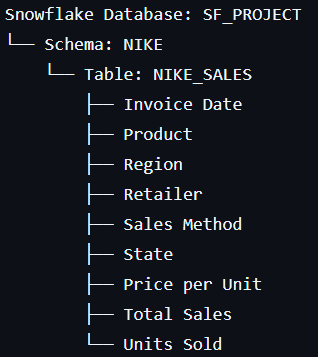

# Nike_sales_Analytics_with_Snowflake_and_Streamlit
## Nike Sales Analytics Dashboard 👟
A comprehensive sales analytics dashboard built with Streamlit and Snowflake, providing deep insights into Nike sales performance across multiple dimensions.
🚀 Features
### Core Analytics

Real-time Sales Monitoring - Track total sales, units sold, and performance metrics
Interactive Filtering - Filter by date range, products, regions, retailers, and sales methods
Multi-dimensional Analysis - Analyze sales trends across time, geography, and product categories

### Advanced Analytics

RFM Analysis - Customer segmentation based on Recency, Frequency, and Monetary value
Market Basket Analysis - Identify products frequently bought together
Sales Velocity - Track product performance and consistency metrics
Seasonal Patterns - Discover monthly and weekly sales trends
ABC Analysis - Inventory categorization for optimized stock management

### Business Intelligence

Customer Lifetime Value (CLV) - Retailer value assessment
Performance Benchmarking - Top vs bottom performer analysis
Growth Analysis - Month-over-month growth tracking
Regional Performance Matrix - Cross-dimensional performance heatmaps

## 🛠️ Tech Stack

Frontend: Streamlit
Database: Snowflake
Visualization: Plotly Express
Data Processing: Pandas, NumPy
Deployment: Streamlit Cloud

## 📊 Data Architecture

## 🎯 Key Insights Delivered

Sales Performance: Track revenue trends and identify peak periods
Customer Segmentation: Classify retailers into actionable segments
Product Analysis: Identify best/worst performing products
Regional Intelligence: Understand geographical sales patterns
Cross-selling Opportunities: Discover product association patterns

## 📈 Dashboard Highlights

Interactive Visualizations - Dynamic charts and graphs
Real-time Filtering - Instant data updates based on selections
Export Capabilities - Download filtered data and reports
Performance Metrics - Monitor dashboard efficiency
Mobile Responsive - Access insights on any device

## 🔧 Setup Requirements

Snowflake account with access to Nike sales data
Streamlit environment
Required Python packages (pandas, plotly, streamlit)

## 🏆 Business Impact
This dashboard empowers stakeholders to:

Make data-driven decisions on inventory management
Optimize sales strategies across regions and channels
Identify high-value customers and growth opportunities
Monitor performance against business objectives
Discover actionable insights for revenue optimization

## 📱 Usage
The dashboard provides an intuitive interface for exploring Nike sales data through:

Interactive filters for data segmentation
Multiple visualization tabs for different analysis types
Advanced analytics for deeper business insights
Export functionality for further analysis
